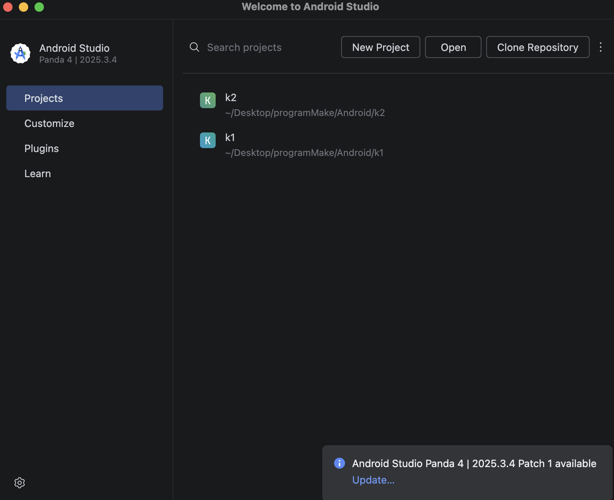
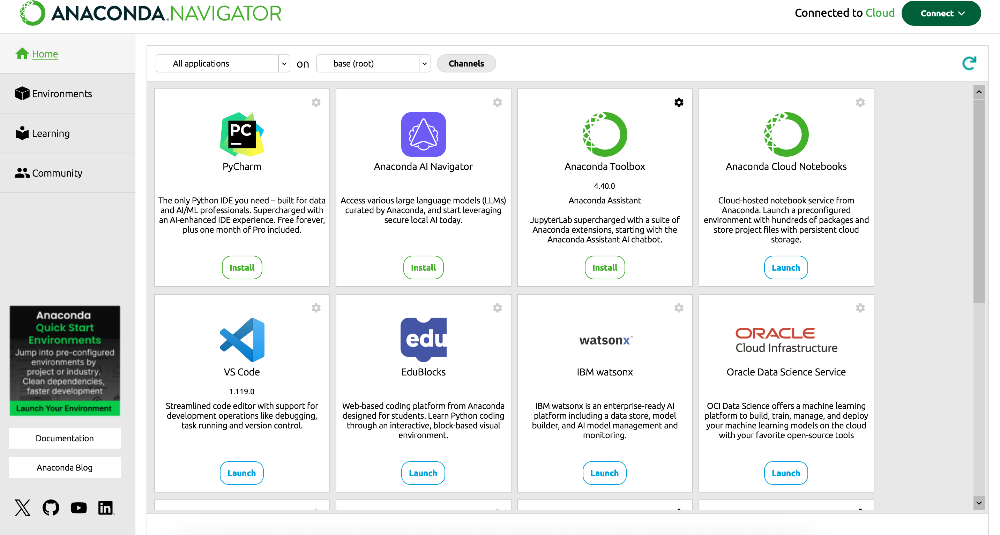

# 实验一：安装相关软件实验报告

## 1. 实验目标
* 安装 Android Studio 4.1 以上版本，支持 LiteRT。
* 安装 Anaconda 及 Jupyter Notebook 环境，用于机器学习模型构建。
* 安装 Visual Studio Code 代码编辑器。
* 将安装过程以 Markdown 语法描述，并上传至 Github

---

## 2. Android Studio 安装
安装 Android Studio 4.1 以上版本。
* **安装完成截图**：
  

---

## 3. Anaconda 与 Jupyter Notebook 安装
Anaconda 提供了在单台机器上执行数据科学和机器学习的最简单方法，包含了 conda 和 Python 环境隔离工具。
* **安装注意事项**：
    * **路径要求**：安装路径不能包含中文、空格。
    * **权限选择**：选择 "Just me"。
    * **环境变量**：在高级选项中勾选 "Register Anaconda3 as my default Python 3.9"（或当前默认版本）。
* **安装完成截图**：
  
* **验证方式**：
    * 成功启动 **Anaconda Navigator**。

---

## 4. 总结
通过本次实验，我成功搭建了移动端应用开发环境（Android Studio）与机器学习开发环境（Anaconda/VS Code），并掌握了使用 Markdown 记录开发过程并同步至 GitHub 的流程。
